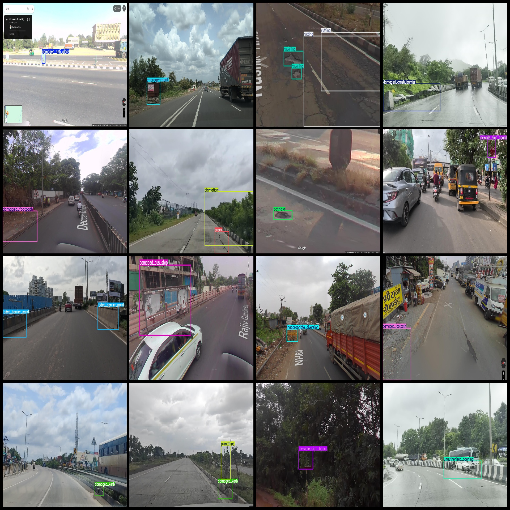
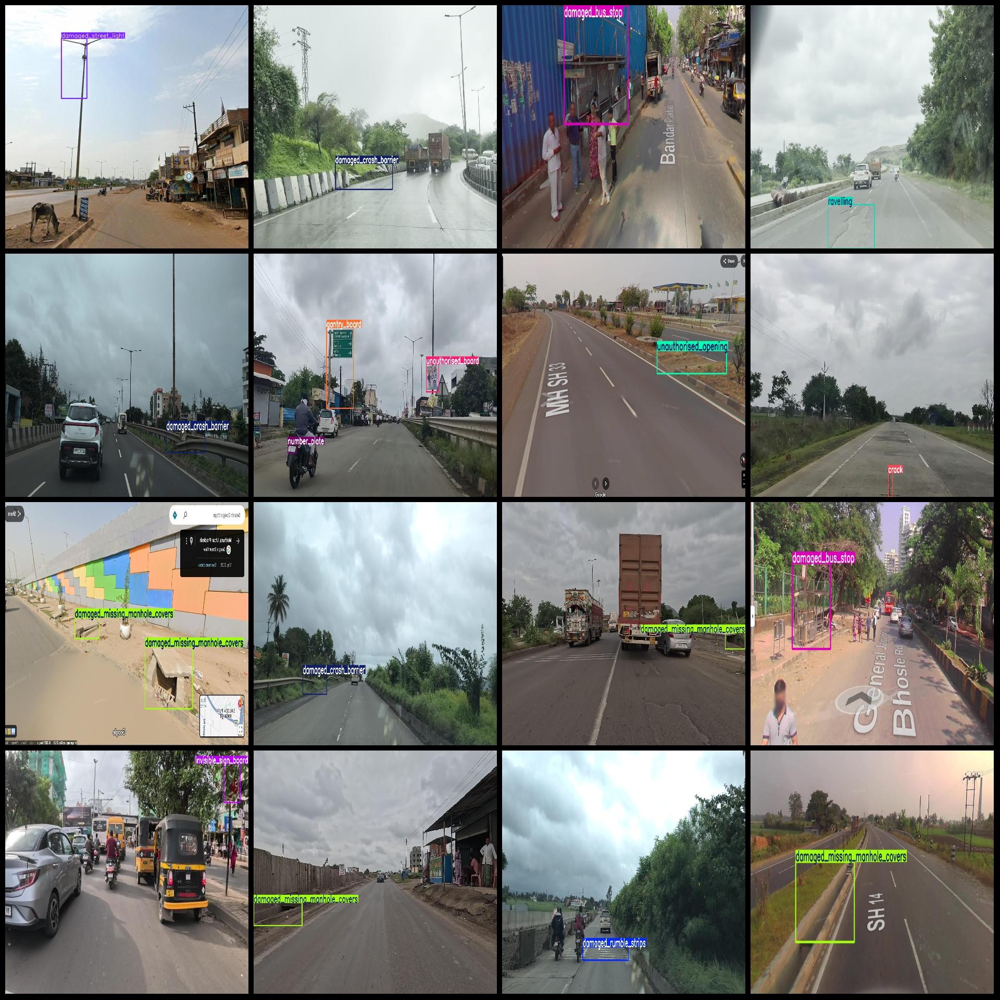

# Smart Traffic Signs, Fades, Manhole Covers, and Missing Lamps Data Set - Indicator Board Damage, Roadway Abnormalities Detection - VOC+YOLO Format - 1164 Images, 37 Categories

The dataset consists of 1,164 images, with 37 categories. The number of frames for each category is:
- Cleaning required (need to be cleaned): 17 frames
- Crack (cracks): 192 frames
- Damaged anti-glare (anti-glare damage): 150 frames
- Damaged attenuator (buffer facilities damage): 12 frames
- Damaged blinker (warning light damage): 22 frames
- Damaged bus stop (bus stop damage): 83 frames
- Damaged crash barrier (collision barrier damage): 60 frames
- Damaged delineator (contour marker damage): 41 frames
- Damaged footpath (pedestrian path damage): 35 frames
- Damaged hazard marker (hazard warning sign damage): 9 frames
- Damaged kerb (kerb damage): 35 frames
- Damaged missing manhole covers (manhole cover/missing damage): 70 frames
- Damaged road studs (road stud/tamp damage): 42 frames
- Damaged rumble strips (speed bump damage): 31 frames
- damaged_sign_board：34 frames
- damaged_street_light：51 frames
- edge_drop：42 frames
- encroachment：40 frames
- excessive_vegetation：2 frames
- face：9 frames
- faded_barrier_paint：31 frames
- faded_kerb：19 frames
- faded_marking：37 frames
- gantry_board：22 frames
- hotspot：9 frames
- inappropriate_diversion：18 frames
- invisible_sign_board：38 frames
- number_plate：125 frames
- plantation：71 frames
- pothole：26 frames
- rain_cuts：5 frames
- ravelling：54 frames
- rutting：14 frames
- unauthorised_board：27 frames
- unauthorised_opening：44 frames
- water_stagnation：15 frames
- work_in_progress：29 frames
## Images

Here is a pay link on Stripe ( https://buy.stripe.com/3cs8yP7sY87d0vu9AB ). Please contact me lonlonago@foxmail.com after funding $89, and I will send you a complete data files , thank you!

